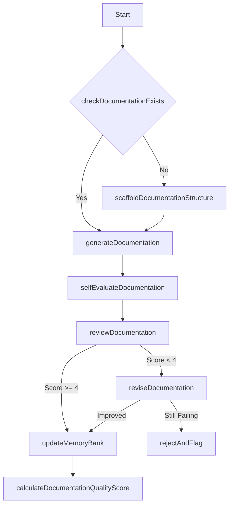

# Documentation Workflow

This workflow defines the process for creating and maintaining high-quality documentation.

## Steps

1. **Check Documentation Exists**: Verify if documentation exists for the current context
   // Cascade checks if relevant documentation files exist

2. **Scaffold Documentation Structure**: Create documentation structure following unified format
   // Cascade creates appropriate document templates

3. **Generate Documentation**: Create comprehensive documentation for current context
   // Cascade generates documentation based on code analysis and memory bank

4. **Self-Evaluate Documentation**: Score documentation quality on 10-point scale
   // Cascade evaluates documentation against best practices:
   // - Completeness (0-2 points)
   // - Clarity (0-2 points)
   // - Accuracy (0-2 points)
   // - Examples (0-2 points)
   // - Technical depth (0-2 points)

5. **Review Documentation**: Perform critical review of documentation on 5-point scale
   // Cascade performs a second-pass review with stricter criteria

6. **Revise Documentation**: Improve documentation based on review feedback
   // Cascade modifies documentation to address deficiencies 

7. **Update Memory Bank**: Synchronize all memory layers with new information
   // Cascade updates memory bank with new documentation insights

8. **Calculate Documentation Quality Score**: Compute numerical quality score
   // Cascade calculates a final quality score to track improvement over time

## Documentation Quality Criteria

- **Level 5**: Exceptional - Complete, clear, accurate with excellent examples
- **Level 4**: Good - Complete, clear, accurate but may lack some examples
- **Level 3**: Adequate - Complete and mostly clear but may have minor inaccuracies
- **Level 2**: Needs Improvement - Incomplete or unclear in some areas
- **Level 1**: Poor - Significant gaps, unclear, or inaccurate

## Documentation Format Standards

All documentation should include:

1. Clear title and summary
2. Purpose and scope
3. Usage examples
4. API/interface details (if applicable)
5. Dependencies and requirements
6. Related components
7. Changelog (for evolving components)
