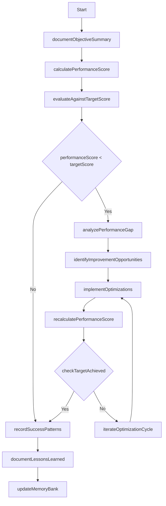

# Evaluation Workflow

This workflow defines the process for evaluating task performance and implementing improvements.

## Steps

1. **Document Objective Summary**: Record clear objectives for evaluation
   // Cascade documents the specific goals and requirements of the task

2. **Calculate Performance Score**: Compute numerical score based on performance standards
   // Cascade evaluates the implementation against defined metrics:
   // - Functionality (0-10 points)
   // - Code Quality (0-10 points)
   // - Documentation (0-10 points)
   // - Performance (0-10 points)
   // - Usability (0-10 points)

3. **Evaluate Against Target Score**: Compare actual score against required threshold
   // Cascade compares the performance score against the minimum acceptable score

4. **Analyze Performance Gap**: Identify specific areas causing performance shortfall
   // Cascade analyzes which metrics are below the required threshold

5. **Identify Improvement Opportunities**: Determine specific optimization opportunities
   // Cascade identifies specific ways to improve the implementation

6. **Implement Optimizations**: Apply targeted improvements to solution
   // Cascade implements the identified improvements

7. **Recalculate Performance Score**: Recompute score after optimizations
   // Cascade re-evaluates the implementation after improvements

8. **Check Target Achieved**: Verify if performance target has been met
   // Cascade determines if the implementation now meets requirements

9. **Iterate Optimization Cycle**: Repeat optimization process if needed
   // Cascade continues optimizing until requirements are met

10. **Record Success Patterns**: Document successful optimization patterns
    // Cascade documents which improvements were most effective

11. **Document Lessons Learned**: Record insights gained during optimization
    // Cascade captures key lessons for future reference

12. **Update Memory Bank**: Update memory bank with new information
    // Cascade ensures insights are preserved in the memory bank

## Performance Metrics

- **Functionality**: Does it correctly implement all requirements?
- **Code Quality**: Is the code well-structured, maintainable, and following best practices?
- **Documentation**: Is the code and functionality well-documented?
- **Performance**: Does it perform efficiently with appropriate resource usage?
- **Usability**: Is the interface intuitive and user-friendly?

## Target Score Thresholds

- **Minimum Acceptable**: 35/50 (70%)
- **Good**: 40/50 (80%)
- **Excellent**: 45/50 (90%)
