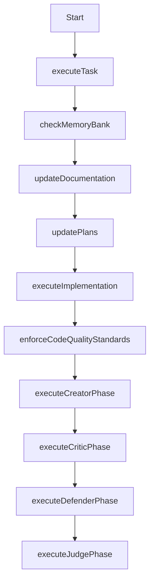

# Implementation Workflow

This workflow defines the process for implementing tasks with quality assurance and memory integration.

## Steps

1. **Execute Task**: Define the scope and objectives of the implementation task
   // Cascade clarifies the specific implementation requirements

2. **Check Memory Bank**: Review memory bank for relevant context
   // Cascade loads appropriate context from memory-bank files

3. **Update Documentation**: Update documentation with the planned changes
   // Cascade documents the planned implementation approach

4. **Update Plans**: Record implementation plans in appropriate structure
   // Cascade updates .windsurf/plans/ with implementation details

5. **Execute Implementation**: Perform the actual coding work
   // Cascade implements the required functionality

6. **Enforce Code Quality Standards**: Apply quality standards to implementation
   // Cascade ensures the code meets project standards:
   // - Follows project architecture patterns
   // - Has appropriate error handling
   // - Is well-commented
   // - Is optimized for performance where appropriate
   // - Has no dead code or unused imports

7. **Execute Creator Phase**: Generate comprehensive initial solution
   // Cascade creates the initial implementation

8. **Execute Critic Phase**: Identify weaknesses, edge cases, assumptions
   // Cascade critically evaluates the implementation for potential issues

9. **Execute Defender Phase**: Address criticisms systematically
   // Cascade resolves the identified issues

10. **Execute Judge Phase**: Compare original and improved versions
    // Cascade makes a final determination on the quality and correctness

## Code Quality Standards

All implementations must adhere to these standards:

1. **Functionality**: Code performs its intended function correctly
2. **Reliability**: Code handles error conditions gracefully
3. **Efficiency**: Resource usage is appropriate for the task
4. **Maintainability**: Code is structured for future modification
5. **Documentation**: Code is well-commented and documented
6. **Test Coverage**: Critical paths have appropriate tests
7. **Dependencies**: External dependencies are properly managed