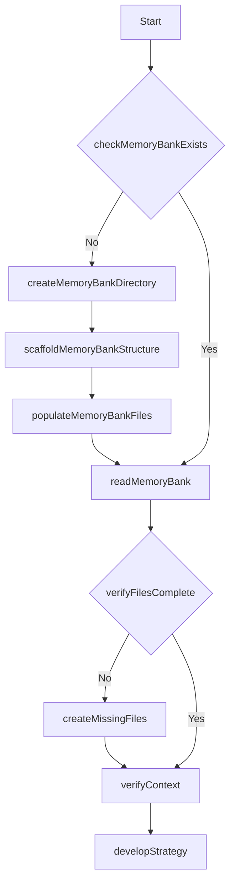

# Memory System Initialization Workflow

This workflow defines the process for initializing the memory bank system.



## Steps

1. **Check Memory Bank Exists**: Verify if memory-bank directory exists
   ```bash
   [ -d "./memory-bank" ] && echo "Memory bank exists" || echo "Memory bank does not exist"
   ```
   
2. **Create Memory Bank Directory**: Create directory if it doesn't exist
   ```bash
   mkdir -p ./memory-bank
   ```

3. **Scaffold Memory Bank Structure**: Create all required files structure
   ```bash
   touch ./memory-bank/projectbrief.md
   touch ./memory-bank/productContext.md
   touch ./memory-bank/activeContext.md
   touch ./memory-bank/systemPatterns.md
   touch ./memory-bank/techContext.md
   touch ./memory-bank/progress.md
   touch ./memory-bank/decisionLog.md
   ```

4. **Populate Memory Bank Files**: Create initial content for all files
   // This step requires Cascade to generate appropriate initial content

5. **Read Memory Bank**: Load all memory layers
   // This step is performed by Cascade

6. **Verify Files Complete**: Check if all required files exist and have content
   ```bash
   for file in projectbrief.md productContext.md activeContext.md systemPatterns.md techContext.md progress.md decisionLog.md; do
     [ -s "./memory-bank/$file" ] || echo "Missing or empty: $file"
   done
   ```

7. **Create Missing Files**: Create any missing files
   // This step requires Cascade to generate appropriate content

8. **Verify Context**: Validate memory bank consistency
   // This step requires Cascade to analyze content

9. **Develop Strategy**: Create implementation plan based on memory bank content
   // This step requires Cascade to formulate strategic approach
