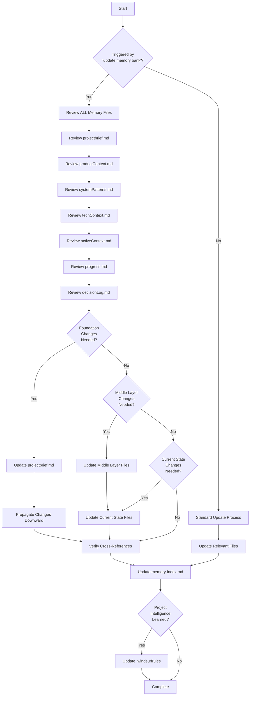

# Memory Bank Update Process

This workflow enforces the mandatory review and update of ALL memory bank files when triggered by the phrase "update memory bank".

## Comprehensive Review Process

When triggered by the phrase "update memory bank", this workflow enforces these critical requirements:

1. **ALL files must be reviewed** - Not just those that obviously need updates
2. **Hierarchy must be preserved** - Changes flow downward through the dependency hierarchy
3. **Consistency must be verified** - Cross-references and dependencies must remain valid
4. **Project intelligence must be captured** - New patterns and insights must be documented in `.windsurfrules`

## Update Steps

1. **Review Foundation Layer**
   - projectbrief.md - Core requirements and mission
   - Any changes here affect ALL other files

2. **Review Context Layer**
   - productContext.md - Why the project exists
   - systemPatterns.md - Architectural patterns
   - techContext.md - Technical implementation details
   - Changes here affect current state files

3. **Review Current State Layer**
   - activeContext.md - Current focus and next steps
   - progress.md - Status and achievements
   - decisionLog.md - Key decisions and rationale

4. **Update Modified Files**
   - Make necessary changes based on review
   - Ensure downward propagation of changes
   - Maintain cross-references between files

5. **Update Indexing**
   - Update timestamps in memory-index.md
   - Update checksums to detect future inconsistencies
   - Document the update process in task logs

6. **Update Project Intelligence**
   - Capture new patterns in `.windsurfrules`
   - Document learned workflows and preferences
   - Track evolving project decisions

## Critical Requirements

- Every memory update trigger must review ALL files
- Focus particularly on activeContext.md and progress.md as they track current state
- After every memory reset, begin completely fresh - the Memory Bank is the only link to previous work