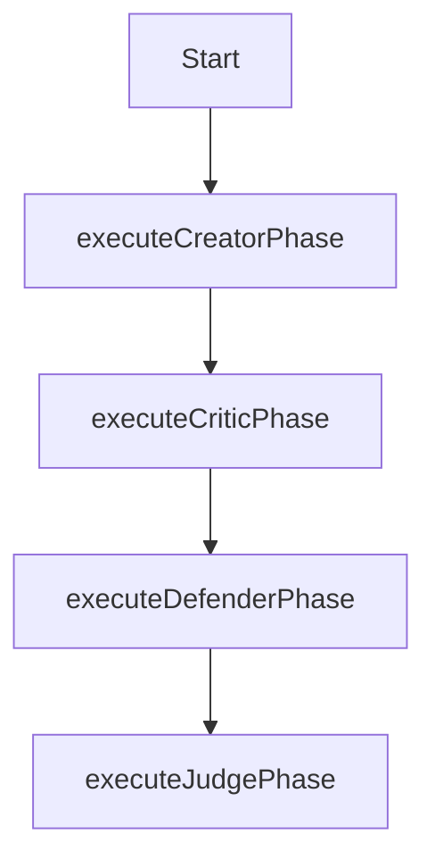

# Self-Critique Workflow

This workflow defines the process for systematically improving solutions through multi-perspective examination.

## Steps

1. **Execute Creator Phase**: Generate comprehensive initial solution
   // Cascade creates an initial implementation with these considerations:
   // - Fulfill all explicit requirements
   // - Follow best practices
   // - Leverage appropriate design patterns
   // - Ensure maintainability
   // - Consider edge cases

2. **Execute Critic Phase**: Identify weaknesses, edge cases, assumptions
   // Cascade critically analyzes the solution:
   // - Identify potential failure modes
   // - Question assumptions
   // - Consider performance under load
   // - Check for security vulnerabilities
   // - Assess maintainability concerns
   // - Evaluate test coverage

3. **Execute Defender Phase**: Address criticisms systematically
   // Cascade resolves identified issues:
   // - Prioritize issues by impact and likelihood
   // - Propose specific solutions for each issue
   // - Implement fixes and mitigations
   // - Document why certain issues may be acceptable

4. **Execute Judge Phase**: Compare original and improved versions
   // Cascade evaluates improvement:
   // - Compare before/after solutions objectively
   // - Validate that issues were addressed
   // - Ensure no regressions
   // - Determine if further iterations are needed
   // - Document final quality assessment

## Self-Critique Roles

### Creator
Focus on building a complete, working solution that meets requirements. The creator is optimistic and forward-thinking, focusing on getting something that works.

### Critic
Find flaws, edge cases, and potential problems. The critic is skeptical and detail-oriented, assuming things will break and looking for those breaking points.

### Defender
Address the critic's concerns with specific solutions. The defender is problem-solving oriented, finding ways to overcome identified issues.

### Judge
Evaluate whether the improved solution adequately addresses the identified issues. The judge is balanced and objective, determining if the solution meets quality standards.

## Quality Criteria

1. **Correctness**: Solution correctly implements requirements
2. **Robustness**: Solution handles edge cases
3. **Performance**: Solution is efficient
4. **Security**: Solution is secure
5. **Maintainability**: Solution is clear and maintainable
6. **Testability**: Solution can be effectively tested
