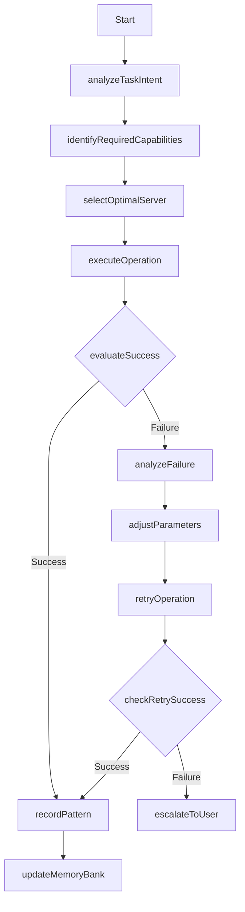

# Smart MCP Integration Workflow

This workflow defines how to intelligently select and use Model Context Protocol (MCP) servers based on task requirements rather than explicit server selection.



## Steps

1. **Analyze Task Intent**: Determine the core purpose of the user's request
   ```javascript
   function analyzeTaskIntent(userRequest) {
     // Extract intent using natural language understanding
     return { primaryIntent, secondaryIntents };
   }
   ```

2. **Identify Required Capabilities**: Map intent to necessary capabilities
   ```javascript
   function identifyRequiredCapabilities(intent) {
     const capabilityMap = {
       'code_creation': ['code_generation', 'documentation'],
       'version_control': ['repository_management', 'code_review'],
       'web_interaction': ['navigation', 'content_extraction'],
       'database': ['query_execution', 'schema_management']
     };
     return capabilityMap[intent.primary] || [];
   }
   ```

3. **Select Optimal Server**: Choose the best MCP server based on capabilities
   ```javascript
   function selectOptimalServer(capabilities, history) {
     // Score each server based on capabilities and past performance
     return bestMatchingServer;
   }
   ```

4. **Execute Operation**: Perform the action using the selected server
   ```javascript
   function executeOperation(server, parameters) {
     return server.execute(parameters);
   }
   ```

5. **Evaluate Success**: Determine if the operation was successful
   ```javascript
   function evaluateSuccess(result) {
     return result.status === 'success';
   }
   ```

6. **Record Pattern**: Document successful approach in memory
   ```javascript
   function recordPattern(task, server, result) {
     memory.savePattern({
       task: task.type,
       server: server.id,
       success: true,
       performance: result.metrics
     });
   }
   ```

7. **Update Memory Bank**: Ensure memory system reflects latest learnings
   ```javascript
   function updateMemoryBank(patterns) {
     // Update activeContext.md with new MCP integration patterns
   }
   ```

## Benefits

- **Context Preservation**: Maintains task context across different MCP servers
- **Adaptability**: System improves server selection based on past performance
- **Transparency**: Documents why specific MCP servers were chosen for tasks
- **Efficiency**: Reduces the need for user specification of servers