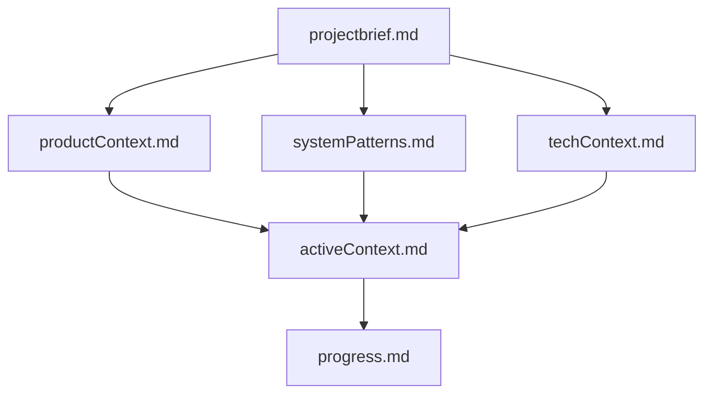
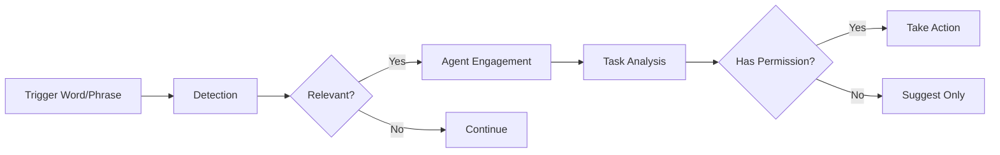
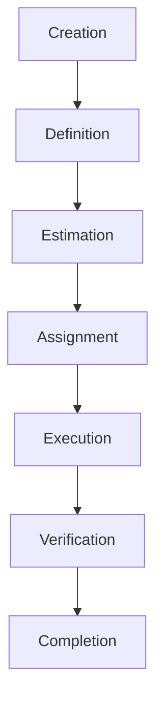
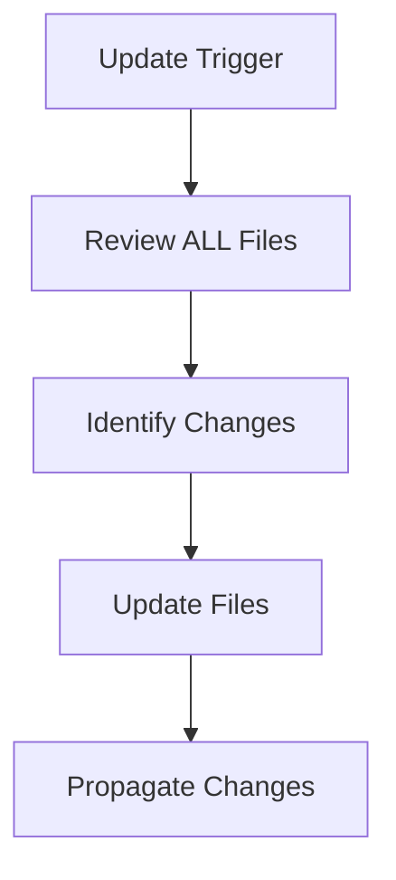

# System Patterns

## Architecture Overview

The Windsurf Project Template follows a modular architecture with clear separation between:

1. **Memory System** - Persistent project context
2. **Agent Framework** - Role-based collaboration model
3. **Workflow Engine** - Process definitions and triggers
4. **Task Management** - Work item tracking and execution

## Key Design Patterns

### Memory Bank Pattern

- Hierarchical documentation structure
- "Source of truth" foundation document
- Context propagation through dependent files
- Clear update triggers and responsibilities

### Agent Collaboration Pattern

- Trigger-based engagement
- Permission-bounded actions
- Cross-functional team structure
- Clear responsibility domains

### Task Management Pattern

- Small, well-defined tasks (max 2 hours)
- Clear acceptance criteria
- TDD workflow integration
- Progress tracking

### Documentation Update Pattern

- Explicit update triggers
- Hierarchical updates (foundation first)
- Change propagation to dependent files
- Consistent formatting and structure

## Component Relationships

The system components interact in these key ways:

1. **Memory Bank ⟷ Agents**: Agents read from and write to the memory bank to maintain context
2. **Agents ⟷ Workflows**: Workflows define when and how agents engage
3. **Workflows ⟷ Tasks**: Tasks are created, tracked and completed through defined workflows
4. **Tasks ⟷ Memory Bank**: Task status and outcomes update the memory bank

## Anti-Patterns to Avoid

1. **Memory Drift** - Memory bank files becoming inconsistent with each other
2. **Role Confusion** - Agents operating outside their defined responsibilities
3. **Workflow Bypass** - Skipping defined processes for expediency
4. **Documentation Debt** - Allowing memory bank to become outdated

---
*Note: This document builds on projectbrief.md and should be referenced by activeContext.md*
